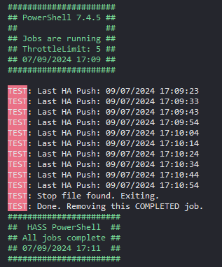

# Home Assistant Add-on: PowerShell for Home Assistant

Run PowerShell scripts as threaded jobs in Home Assistant with logging.

![Supports amd64 Architecture][amd64-shield]

## About

This add-on allows you to run arbitrary PowerShell (7+) scripts that YOU create.

The scripts can be placed in either the `\\{HASS}\share\pwsh` folder, or a NAS share off `\\{HASS}\share\`. Add script files to the folder and declare the `Scripts` in the `Configuration` section.

## How do I use it?

There's two ways.
 - **Declared** - script file names you set in the configuration.
 - **On-demand** - script file names you send to the add-on.

For **Declared** scripts, either:
1. Copy your scripts to `\\{HASS}\share\pwsh` (create it if you need to), then add the file names of the scripts to the `Scripts` section in `Configuration` as shown below.
2. Use Home Assistant's Add Network storage feature to mount a network location as a `Share` type. Ensure this is available to Home Assistant by navigating to eg. `\\{HASS}\share\mynasfolder`. Place your scripts there and declare the path appropriately as part of the `Scripts` section, with a trailing forward slash.

```yaml
- filename: My-AwesomeScript.ps1 # in share/pwsh/
- filename: My-OtherAwesomeScript.ps1
  path: /share/mynasfolder/scripts/
- filename: TEST.ps1 # in share/pwsh/
```

Start the add-on and review the `Log` section to see any output.

For **On-demand** scripts:
1. Ensure that the `On-demand` feature toggle is enabled in the `Configuration` section of the add-on.
2. Follow the same process as for **Declared** scripts to get your scripts in to a directory off `/share/`
3. Use the Home Assistant Action `hassio.addon_stdin` to send properly formatted data containing the `filename`s and their `path`s (if not in `/share/pwsh/`) to the add-on.

```yaml
action: hassio.addon_stdin
data:
  addon: {{addon_slug_name}}
  input:
    scripts:
      - filename: On-Demand.ps1
      - filename: Test-Script.ps1
        path: /share/pwsh/
```

Yes, this means you can schedule or run PowerShell scripts as Actions in Automations and Scripts.

_**NB**: A side effect of running scripts on-demand means that the data you send to the add-on with `hassio.addon_stdin` appears as formatted JSON in the `Log` section of the add-on. This is harmless and appears due to the way PowerShell listens for content._

## How does it work?

The add-on is just a Docker container with PowerShell installed which, when started, kicks off a threading script that retrieves scripts by their name and path as specified in the `Configuration > Scripts` section.

**Declared** scripts are executed as PowerShell threaded jobs using `Start-ThreadJob`. The jobs are regularly checked for any output and "received" by the parent threading process, such that you can get logs from your scripts without jumping through hoops.

**On-Demand** scripts run using `Start-Process` with only the `-File <path>` argument supplied to the process.

## Why does it only run my script once or the add-on keep stopping?

If your script would start, do stuff and then return you to a PowerShell prompt when run on your own computer, that's exactly what it will do in this add-on too. If you need your scripts to run at arbitrary times, enable the `On-Demand` feature and use Home Assistant's `hassio.addon_stdin` Action as discussed above. If your script finishes, the add-on's logs will tell you that the job has been removed and its state at that point.

If you need your script to run continuously at set intervals, don't just spam the `On-Demand` feature, consider wrapping it in an appropriate loop (`while`, `do-while`, `do-until`, `for`, `foreach` etc.) just as you would to have it run continuously on your own computer, but be aware that if using a `while`, `do-while` or `do-until` loop that you include a suitable `Start-Sleep` with a *sensible* delay at the end or beginning of the loop or this add-on will consume all available container resources - **_don't say I didn't warn you!_**

If the add-on is stopping, then it either has no scripts to run, it has finished running the scripts, something failed or the `On-Demand` feature isn't enabled. Obviously these are *your* scripts, the add-on is just running them as a threaded job for **Declared** scripts or as a Start-Process for **On-Demand** scripts.

If your script isn't working, please don't ask me to fix it or ask me why it isn't working. Take it back to your computer and try running it as a threaded job (see [Start-ThreadJob](https://learn.microsoft.com/en-us/powershell/module/threadjob/start-threadjob?view=powershell-7.4)) to see what happens. If you believe you found the reason and it could be related to the threading script, please feel free to let me know.

## How do I provide arguments to my scripts?

In this iteration, you can't. You would need to add or declare all your arguments as variables and store them within the script.

Technically there's no reason why you can't have this add-on run a script that calls your other script but logging may not work as expected or you'll need to manage that in your script yourself.

## Logging

For **Declared** scripts, logs are output to the `Log` section of the add-on, logs are colour highlighted to aid visibility and named according to the name of the script.

TIP: Use `Write-Output` in your scripts.

NB: If you use `Write-Host` you will receive the output immediately in the `Log` section of the add-on, but the output would not be associated with any script, unless you do that yourself.

For a script called `TEST.ps1` and declared in the Scripts section as `- filename: TEST.ps1`, logging might look something like this.



For **On-Demand** scripts, logging is on a best-effort basis since the script runs in a separate process. It might be wise to handle logging to a file yourself, if you need it.

## I want to export/import some data to/from a file.

The container has read/write access to the `/share` folder and all of its sub-folders only, it cannot read `/config` since it (currently) doesn't need to.

This _does_ mean that you can use Home Assistant's Network Storage feature to mount a network folder from eg. a NAS and have your PowerShell script dropping or retrieving anything, like logs, from there that you want it to.

## Ugh! PowerShell?!

Yes. It's an open-source (MIT License) scripting language that you can actually do quite a lot with and this add-on simply enables another option for Home Assistant users to automate their home.

### Well, I can do all that with Python/Shell Script/Go...etc.

Like me, others might be more confident with PowerShell than any of the other options, and even as ubiquitous as Python is, not everyone has the skills.

## I'm dubious about this container, what's it doing?

The code for the add-on is freely available on Github. You can only add the add-on from a suitable public Git repository so, if you're concerned, feel free to fork the code to your own repo, inspect it, add your own repo to Home Assistant and use that as the add-on's source instead.

The add-on is using the base Home Assistant add-on Alpine Linux image which the latest version of PowerShell and its dependencies are installed to. The threading script and stdin listening scripts are then added and that's all. If you want to know more, review the `Dockerfile` in the repository.

[amd64-shield]: https://img.shields.io/badge/amd64-yes-green.svg
